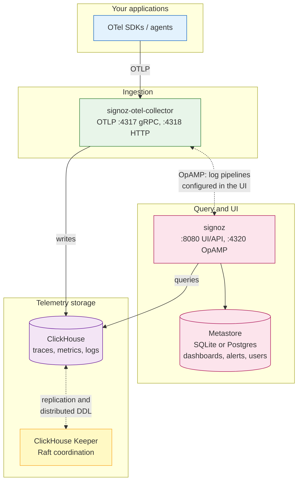
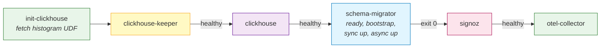

# Self-hosting SigNoz with ClickHouse Keeper

Deployable Docker Compose stacks for running [SigNoz](https://signoz.io) on
**ClickHouse Keeper** instead of ZooKeeper — one single-node stack for a server
or a laptop, one 3-node HA stack — plus the scripts and runbooks to operate
them.

These are real files, not snippets to copy out of a document:

```bash
git clone https://github.com/thaithienvanid/signoz-clickhouse-keeper
cd signoz-clickhouse-keeper
make up          # standalone; make STACK=ha up for the HA cluster
```

Then open <http://localhost:8080>.

> **Upgrading from an earlier revision of this repo?** The configuration in the
> old single-file guide had defects that prevented it from starting at all, and
> it pinned a ClickHouse version SigNoz does not support. Read
> [CHANGELOG.md](CHANGELOG.md) before reusing anything from it.

---

## Contents

| Path | What it is |
|---|---|
| [`deploy/standalone/`](deploy/standalone/) | Single-node stack: 1 Keeper, 1 ClickHouse, SQLite metastore |
| [`deploy/ha/`](deploy/ha/) | HA stack: 3 Keepers, 3 ClickHouse replicas, Postgres, 2 backends, 2 collectors, nginx |
| [`deploy/security/`](deploy/security/README.md) | Auth and TLS fragments merged into a stack on demand |
| [`scripts/`](scripts/) | Validation, smoke test, backup/restore, certificate and credential generation |
| [`docs/standalone.md`](docs/standalone.md) | Single-node walkthrough and configuration reference |
| [`docs/ha.md`](docs/ha.md) | HA architecture, deployment, and failover testing |
| [`docs/operations.md`](docs/operations.md) | Monitoring, backup, scaling, tuning, troubleshooting |
| [`docs/production.md`](docs/production.md) | Going from one host to a real multi-host cluster |
| [`docs/upgrading.md`](docs/upgrading.md) | Version policy and upgrade procedure |
| [`docs/agents.md`](docs/agents.md) | Pointing application SDKs at the gateway |

---

## Why ClickHouse Keeper

ClickHouse needs a consensus service to coordinate replicated tables. Keeper is
ClickHouse's own implementation of the ZooKeeper protocol, and SigNoz's current
deployment tooling uses it by default.

| | ClickHouse Keeper | ZooKeeper |
|---|---|---|
| Runtime | C++, in the ClickHouse binary | JVM |
| Typical RSS | 50–100 MB | 500 MB – 1 GB |
| Consensus | Raft (NuRaft) | ZAB |
| Operations | Same config format, logs, and tooling as ClickHouse | A separate system to learn and tune |
| Snapshots | zstd-compressed by default | Uncompressed |

The protocol is wire-compatible, which is why ClickHouse still calls the
setting `<zookeeper>` when you point it at a Keeper cluster.

---

## Architecture


```mermaid
graph TB
    subgraph clients["Your applications"]
        SDK["OTel SDKs / agents"]
    end

    subgraph ingest["Ingestion"]
        COL["signoz-otel-collector<br/>OTLP :4317 gRPC, :4318 HTTP"]
    end

    subgraph query["Query and UI"]
        SIG["signoz<br/>:8080 UI/API, :4320 OpAMP"]
        META[("Metastore<br/>SQLite or Postgres<br/>dashboards, alerts, users")]
    end

    subgraph storage["Telemetry storage"]
        CH[("ClickHouse<br/>traces, metrics, logs")]
        KPR["ClickHouse Keeper<br/>Raft coordination"]
    end

    SDK -->|OTLP| COL
    COL -->|writes| CH
    COL <-.->|OpAMP: log pipelines<br/>configured in the UI| SIG
    SIG -->|queries| CH
    SIG --> META
    CH <-.->|replication and<br/>distributed DDL| KPR

    style SDK fill:#e3f2fd,stroke:#1565c0
    style COL fill:#e8f5e9,stroke:#2e7d32
    style SIG fill:#fce4ec,stroke:#ad1457
    style META fill:#fce4ec,stroke:#ad1457
    style CH fill:#f3e5f5,stroke:#6a1b9a
    style KPR fill:#fff9c4,stroke:#f9a825
```

Two links in that diagram are easy to miss and are the cause of most
"it starts but doesn't work" reports:

- **OpAMP.** The collector holds a WebSocket back to the SigNoz backend. Log
  parsing pipelines you build in the UI are delivered over it. A collector
  started without `--manager-config` runs fine and silently ignores everything
  you configure in the UI.
- **Keeper.** ClickHouse tables are `Replicated*` even on a single node, so
  ClickHouse is unhealthy whenever Keeper has no quorum — including at first
  start, which is why the compose files gate ClickHouse on Keeper's health
  check.

### Startup order


```mermaid
graph LR
    A["init-clickhouse<br/><i>fetch histogram UDF</i>"] --> B["clickhouse-keeper"]
    B -->|healthy| C["clickhouse"]
    C -->|healthy| D["schema-migrator<br/><i>ready, bootstrap,<br/>sync up, async up</i>"]
    D -->|exit 0| E["signoz"]
    E -->|healthy| F["otel-collector"]

    style A fill:#e8f5e9,stroke:#2e7d32
    style B fill:#fff9c4,stroke:#f9a825
    style C fill:#f3e5f5,stroke:#6a1b9a
    style D fill:#e1f5fe,stroke:#0277bd
    style E fill:#fce4ec,stroke:#ad1457
    style F fill:#e8f5e9,stroke:#2e7d32
```

Every arrow is a real `depends_on` condition, not a suggestion. `docker compose
up -d --wait` will therefore either come up clean or fail loudly.

---

## Versions

| Component | Pinned | Why |
|---|---|---|
| `clickhouse/clickhouse-server` | `25.12.5` | **Hard requirement.** See below. |
| `clickhouse/clickhouse-keeper` | `25.12.5` | Must match the server |
| `signoz/signoz` | `v0.136.1` | Latest release |
| `signoz/signoz-otel-collector` | `v0.144.8` | Latest release; also supplies the schema migrator |
| `postgres` (HA) | `16-alpine` | Metastore |
| `nginx` (HA) | `1.29-alpine` | Load balancer |

**ClickHouse is not "whatever is newest".** SigNoz's deployment tool declares a
compatibility rule ([`foundry/internal/compat/installation/compat.go`](https://github.com/SigNoz/foundry/blob/main/internal/compat/installation/compat.go)):

> collector `> 0.144.5` **requires** clickhouse `= 25.12.5`

Newer ClickHouse tags exist — 26.x has been out for months — and using one puts
you outside what SigNoz tests and supports. `scripts/validate.sh` checks that
every pinned tag still exists on Docker Hub; the weekly CI run is there to
notice when this pin moves.

See [docs/upgrading.md](docs/upgrading.md) for the upgrade procedure.

---

## Quick start

```bash
make init                     # writes deploy/standalone/.env from the example
$EDITOR deploy/standalone/.env    # set CLICKHOUSE_PASSWORD
make up
make bootstrap                # create the organization and admin account
make smoke                    # send telemetry and confirm it is queryable
```

**`make bootstrap` is a required step.** Until SigNoz has an organization it
will not register the collector over OpAMP, and a collector started with
`--manager-config` stays in **no-op mode** until it gets a config — every
receiver replaced by a `nop` receiver. Nothing is ingested and port 4318
refuses connections, all while the container reports healthy. Creating the
account in the UI on first visit does the same thing.

Ports bind to `127.0.0.1` by default. Nothing is reachable from another machine
until you change `BIND_ADDRESS` — and you should not, until you have read
[`deploy/security/README.md`](deploy/security/README.md), because the OTLP
endpoint starts unauthenticated.

Common tasks:

```bash
make ps                       # service status
make logs SERVICE=clickhouse  # one service
make keeper-status            # Raft leader / follower state
make cluster-status           # ClickHouse cluster membership
make backup                   # config + metastore + ClickHouse
make down                     # stop, keep data
make nuke                     # stop and delete every volume
```

All of them take `STACK=ha`.

---

## Enabling authentication

```bash
scripts/gen-htpasswd.sh standalone ingest        # or: openssl rand -hex 32 for a token
scripts/apply-security.sh standalone tls basic-auth
cd deploy/standalone && docker compose -f docker-compose.yaml -f compose.security.yaml up -d
```

Fragments (`basic-auth`, `bearer-auth`, `tls`, `mtls`, `persistent-queue`) are
deep-merged into the collector config, never hand-edited into it. Details and
trade-offs: [`deploy/security/README.md`](deploy/security/README.md).

---

## Validation

`scripts/validate.sh` runs without a Docker daemon and is what CI runs on every
push:

```
docker compose         both stacks and both security overlays resolve
XML config             every Keeper and ClickHouse file is well-formed
YAML config            every collector and fragment file parses
HA replica identity    the three macros files declare three distinct replicas
ClickHouse cluster     both stacks name their cluster 'cluster'
security fragments     all 10 stack x fragment combinations merge, and none
                       drops signoz_health_check from service.extensions
image tags             every pinned tag still resolves on Docker Hub
shell scripts          shellcheck
```

CI additionally stands the standalone stack up for real and pushes telemetry
through it, which is the only way to catch a mistyped environment variable or a
config the collector rejects at load time.

---

## Relationship to upstream SigNoz

SigNoz [deprecated its bundled `docker-compose` manifests and `install.sh`](https://github.com/SigNoz/signoz/blob/main/deploy/README.md)
in favour of **[Foundry](https://github.com/SigNoz/foundry)**, a tool that
generates deployment manifests from a `casting.yaml`.

If you want a vendor-supported install and are happy for a generator to own
your manifests, **use Foundry** — it is the officially supported path, and it
also defaults to ClickHouse Keeper.

This repo exists for the case where you want to read, diff, and own the compose
files yourself. The service topology, environment variables, collector
pipelines and ClickHouse settings here are all cross-checked against what
Foundry generates, so you get the same deployment shape without the generator
in the middle. Where the two differ deliberately, the config says so in a
comment.

---

## Requirements

**Standalone** — 4 cores, 16 GB RAM, 100 GB SSD; Docker Engine 24+ with Compose
v2. It will start on 8 GB, but ClickHouse merges will fight your applications
for memory.

**HA** — see [docs/ha.md](docs/ha.md) and
[docs/production.md](docs/production.md). Running all three replicas on one
Docker host, which is what `deploy/ha/` does out of the box, is a way to test
failover behaviour; it is not fault tolerant, because the host is a single point
of failure.

---

## License

[MIT](LICENSE).

SigNoz and ClickHouse are separate projects under their own licenses; this repo
only contains deployment configuration for them.
