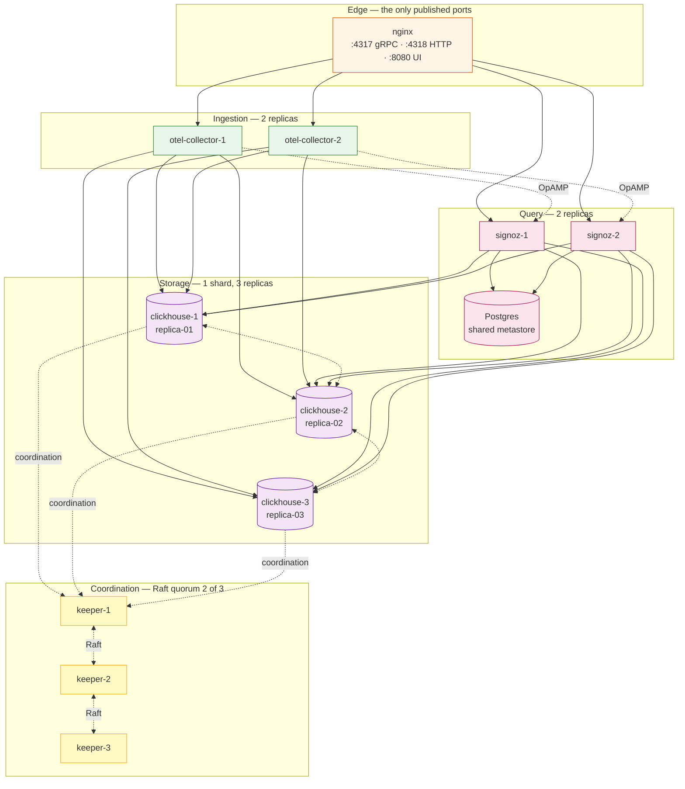

# High-availability deployment

Three Keepers, three ClickHouse replicas, two SigNoz backends, two collectors,
Postgres, and nginx in front.

Files: [`deploy/ha/`](../deploy/ha/)

> **This stack runs on one Docker host.** That makes it excellent for
> exercising failover — you can kill a Keeper and watch a leader election —
> and it is *not* fault tolerant, because the host itself is a single point of
> failure. [production.md](production.md) covers the split across machines.

---

## Topology



### What tolerates what

| Failure | Effect |
|---|---|
| 1 Keeper | None. Election completes in ~1–2s; quorum holds at 2/3. |
| 2 Keepers | **Quorum lost.** ClickHouse goes read-only: ingestion stops, queries keep serving existing data. |
| 1 ClickHouse | None. Two full copies remain; the failed node catches up on restart. |
| 2 ClickHouse | Reads and writes still work against the survivor, but you have one copy of your data. |
| 1 collector | None. nginx routes to the other. |
| 1 SigNoz backend | Brief blip for sessions pinned to it; nginx routes onward. |
| Postgres | UI and alerting stop. **Ingestion continues** — collectors do not depend on the metastore. |
| nginx | Total outage. Run two with a VIP in real production. |

Note the asymmetry that surprises people: losing Keeper quorum stops *writes*
but not *reads*, while losing Postgres stops the *UI* but not *ingestion*.

---

## Why one shard with three replicas

The default here is a single shard replicated three ways — every node holds a
complete copy.

Sharding splits data instead of copying it. A three-shard cluster with no
replicas survives **zero** node failures: lose one and a third of your data is
unreachable. Sharding is a capacity answer, not an availability one, and it
only becomes necessary when a single node can no longer hold the working set.

Start replicated. Add shards when you have measured that you need them, and give
each shard its own replicas when you do.

---

## Deploy

```bash
make STACK=ha init
$EDITOR deploy/ha/.env        # set CLICKHOUSE_PASSWORD and POSTGRES_PASSWORD
make STACK=ha up
```

Startup is slower than standalone — the Keepers have to elect a leader before
ClickHouse will report healthy.

```bash
make STACK=ha ps
make STACK=ha keeper-status
make STACK=ha cluster-status
make STACK=ha smoke
```

`keeper-status` should show exactly one `leader` and two `follower`:

```
keeper-1
  zk_server_state	leader
  zk_followers	2
  zk_synced_followers	2
keeper-2
  zk_server_state	follower
keeper-3
  zk_server_state	follower
```

`smoke` additionally asserts that three **distinct** replica identities are
registered and that no replica is read-only or lagging.

---

## Replica identity

The single most common way to break a ClickHouse cluster is to mount one macros
file on every node.

```xml
<!-- clickhouse/config.d/macros-2.xml -->
<macros>
    <shard>01</shard>
    <replica>replica-02</replica>
</macros>
```

`ReplicatedMergeTree` substitutes these into its Keeper paths. Give three nodes
the same `<replica>` value and all three claim to be the same replica of the
same shard: they contend over one Keeper znode, and replication does not
happen. Nothing reports an error — `docker compose ps` shows three healthy
containers.

Each node therefore mounts the shared `cluster.xml` **plus its own**
`macros-N.xml`. `scripts/validate.sh` asserts the three values are distinct so
a copy-paste cannot reintroduce this.

To confirm on a running cluster:

```bash
make STACK=ha replication-status
```

Three distinct `replica_name` values, `is_readonly` 0, `absolute_delay` near 0.

---

## Cluster name

`<remote_servers>` declares a cluster named exactly `cluster`. This is not a
style choice:

- `signoz-otel-collector migrate *` defaults to `--clickhouse-cluster=cluster`
- the SigNoz backend defaults to `telemetrystore.clickhouse.cluster=cluster`
- `migrate ready` runs `SELECT ... FROM system.clusters WHERE cluster = ?`

Name it `cluster_3S_2R` and `migrate ready` matches no hosts and blocks until
its timeout, with nothing in the logs pointing at the cause.

---

## Testing failover

Do this before you rely on the cluster, not after.

### Lose one Keeper

```bash
docker compose -f deploy/ha/docker-compose.yaml stop clickhouse-keeper-2
make STACK=ha keeper-status          # a new leader if 2 was it
docker exec signoz-clickhouse-1 clickhouse-client \
  --user signoz --password "$CLICKHOUSE_PASSWORD" --query "SELECT 1"
make STACK=ha smoke                  # ingestion unaffected
docker compose -f deploy/ha/docker-compose.yaml start clickhouse-keeper-2
```

### Lose quorum (2 of 3)

```bash
docker compose -f deploy/ha/docker-compose.yaml stop clickhouse-keeper-2 clickhouse-keeper-3

# Writes now fail — this is the split-brain protection working
docker exec signoz-clickhouse-1 clickhouse-client \
  --user signoz --password "$CLICKHOUSE_PASSWORD" \
  --query "CREATE TABLE quorum_probe ON CLUSTER cluster (id Int32) ENGINE = Memory"
# Coordination::Exception: ... Session expired / All connection tries failed

# Reads still work
docker exec signoz-clickhouse-1 clickhouse-client \
  --user signoz --password "$CLICKHOUSE_PASSWORD" \
  --query "SELECT count() FROM signoz_traces.distributed_signoz_index_v3"

docker compose -f deploy/ha/docker-compose.yaml start clickhouse-keeper-2 clickhouse-keeper-3
make STACK=ha keeper-status
```

Refusing writes without a quorum is the correct behaviour. A system that kept
accepting them would be one that lets two halves of a partition diverge.

### Lose one ClickHouse

```bash
docker compose -f deploy/ha/docker-compose.yaml stop clickhouse-2
make STACK=ha smoke                  # still passes
docker compose -f deploy/ha/docker-compose.yaml start clickhouse-2
sleep 30
make STACK=ha replication-status     # absolute_delay returns to ~0
```

### Lose one collector

```bash
docker compose -f deploy/ha/docker-compose.yaml stop otel-collector-1
make STACK=ha smoke                  # nginx routes to collector-2
docker compose -f deploy/ha/docker-compose.yaml start otel-collector-1
```

---

## The load balancer

[`loadbalancer/nginx.conf`](../deploy/ha/loadbalancer/nginx.conf). Points worth
noting:

- `http2 on;` — the `listen ... http2` form is deprecated as of nginx 1.25.1.
  gRPC will not work without HTTP/2.
- `least_conn` rather than round-robin. OTLP exporters hold long-lived
  connections, so request-count balancing pins a heavy client to one collector
  for its lifetime.
- `grpc_next_upstream error timeout non_idempotent` so a collector dying
  mid-stream retries against the other.
- WebSocket upgrade headers on the UI route — SigNoz's live tail needs them.
- `proxy_request_buffering off` — telemetry bodies are large and compressed;
  buffering them to disk adds latency for nothing.
- Its own health endpoint on `:8081`, unpublished.

For real production, run at least two nginx instances behind a virtual IP
(keepalived) or a cloud load balancer. One nginx is a single point of failure
in front of everything else you made redundant.

---

## OpAMP across two backends

Each collector holds its OpAMP session with a different backend, so restarting
one backend does not drop both control channels at once.

Agent configuration is persisted in the shared Postgres metastore, so a log
pipeline edited on either backend reaches both collectors. If you see a
pipeline apply to one collector and not the other, check that both backends are
actually talking to the same Postgres before looking anywhere else.

---

## Backup

```bash
make STACK=ha backup
```

Same shape as standalone, with `pg_dump` in place of the SQLite file. ClickHouse
is backed up from `clickhouse-1` only — the data is replicated, so one copy is
the whole dataset.

---

## Before calling it production

`deploy/ha/` on one host is a test rig. [production.md](production.md) covers
what changes: separate hosts, real volumes, Keeper on dedicated disks,
externally managed Postgres, TLS between tiers, and monitoring the monitoring.
